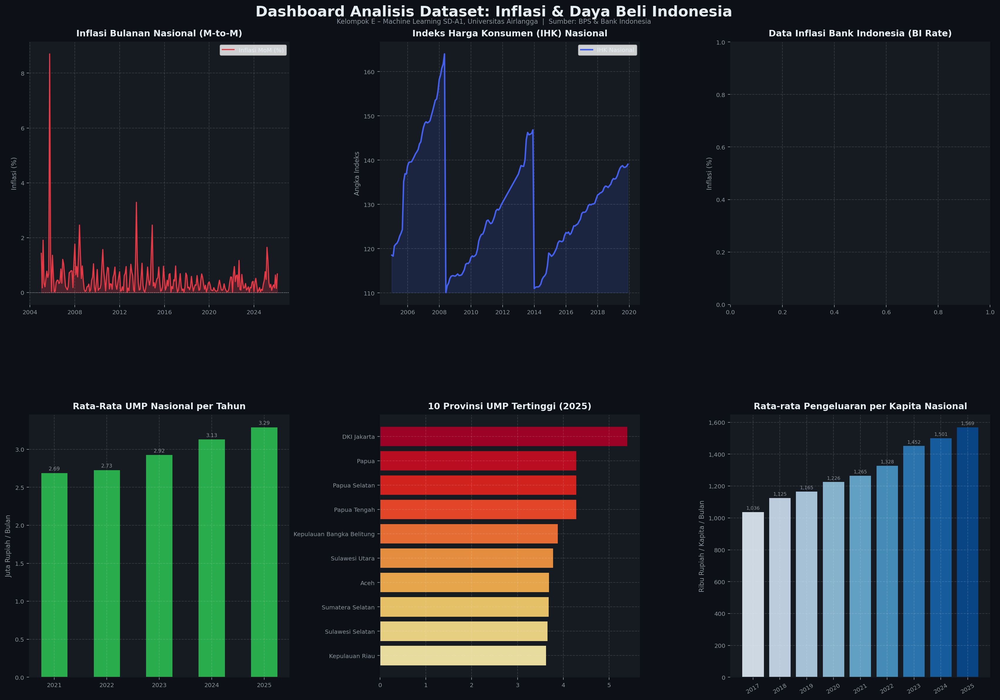

# 📊 Prediksi Inflasi dan Dampaknya terhadap Daya Beli

> **Kelompok E – Machine Learning SD-A1, Universitas Airlangga**

[](https://python.org)
[](https://djangoproject.com)
[](LICENSE)

---

## 🎯 Deskripsi Proyek

Proyek ini bertujuan membantu **Bank Indonesia, Kementerian Keuangan, ekonom, dan peneliti** dalam memahami dinamika inflasi Indonesia. Platform prediksi ini menjawab dua kebutuhan utama:

1. **Forecasting**: Memprediksi nilai inflasi bulanan untuk periode mendatang menggunakan model **LSTM**.
2. **Regresi**: Mengukur seberapa besar dampak perubahan inflasi terhadap **daya beli masyarakat** menggunakan **Linear Regression / Random Forest**.

---

## 🗂️ Struktur Proyek

```
Project-Machine-Learning/
├── datasets/
│   ├── Indeks Harga Konsumen (Umum)/     # IHK per kota, 2005–2019 (BPS)
│   ├── Inflasi Bulanan/                  # Inflasi M-to-M, 2005–2026 (BPS)
│   ├── BI Rate (Data Inflasi)/           # BI Rate & Inflasi YoY (Bank Indonesia)
│   ├── Upah Minimum Provinsi/            # UMP per provinsi, 2021–2025 (BPS)
│   ├── Rata-rata Pengeluaran per Kapita/ # Pengeluaran RT, 2017–2025 (BPS)
│   └── visualisasi_dataset.png           # Dashboard visualisasi dataset
├── explore_datasets.py                   # Script eksplorasi & visualisasi data
├── README.md
└── .gitignore
```

---

## 📦 Dataset

| # | Dataset | Sumber | Rentang | Frekuensi |
|---|---------|--------|---------|-----------|
| 1 | **Indeks Harga Konsumen (IHK)** | [BPS](https://www.bps.go.id/id/statistics-table/2/MiMy/indeks-harga-konsumen--umum-.html) | 2005–2019 | Bulanan |
| 2 | **Inflasi Bulanan (M-to-M)** | [BPS](https://www.bps.go.id/id/statistics-table/2/MSMy/inflasi--umum-.html) | 2005–2026 | Bulanan |
| 3 | **BI Rate / Data Inflasi** | [Bank Indonesia](https://www.bi.go.id/id/statistik/indikator/data-inflasi.aspx) | Historis | Bulanan |
| 4 | **Upah Minimum Provinsi (UMP)** | [BPS Jateng](https://jateng.bps.go.id/id/statistics-table/2/MjgyNCMy/upah-minimum-provinsi-ump-per-bulan-menurut-provinsi-di-indonesia.html) | 2021–2025 | Tahunan |
| 5 | **Rata-rata Pengeluaran per Kapita** | [BPS](https://www.bps.go.id/id/statistics-table/3/V1ZKMWVrSTNOek5ZZUZOcVZEZGFValJvV0hWalFUMDkjMyMwMDAw) | 2017–2025 | Tahunan |

---

## 📈 Visualisasi Dataset



---

## 🤖 Pendekatan Machine Learning

### Model 1 – Forecasting Inflasi (LSTM)
- **Input**: Deret waktu inflasi bulanan + IHK
- **Output**: Prediksi inflasi 1–6 bulan ke depan
- **Metrik**: MAE, RMSE

### Model 2 – Dampak Inflasi terhadap Daya Beli (Regresi)
- **Input**: Inflasi, BI Rate, UMP
- **Output**: Perubahan pengeluaran per kapita / daya beli riil
- **Metrik**: R², MSE, koefisien regresi

---

## 🚀 Cara Menjalankan

### Prasyarat
```bash
pip install pandas numpy matplotlib seaborn openpyxl scikit-learn tensorflow django
```

### Eksplorasi Dataset
```bash
python explore_datasets.py
```

### Menjalankan Web Dashboard (Django)
```bash
cd dashboard
python manage.py runserver
```

---

## 🖥️ Output Dashboard (Django)
- Grafik prediksi inflasi lengkap dengan interval kepercayaan
- Visualisasi hubungan inflasi vs daya beli
- Fitur simulasi proyeksi daya beli jika inflasi naik X%
- Monitoring akurasi model (MAE, RMSE, R²)

---

## 👥 Anggota Kelompok E

| Nama | NIM |
|------|-----|
| Muhammad Rajif Al Farikhi | 162112133008 |
| Sahrul Adicandra Effendy | 164231013 |
| Semaya David Petroes Putra | 164231048 |
| Adrina Firda Marwah | 164231087 |
| Okan Athallah Maredith | 164231088 |

---

## 📚 Referensi
- Badan Pusat Statistik (BPS): https://www.bps.go.id
- Bank Indonesia: https://www.bi.go.id
- Universitas Airlangga – Program Studi Sains Data
